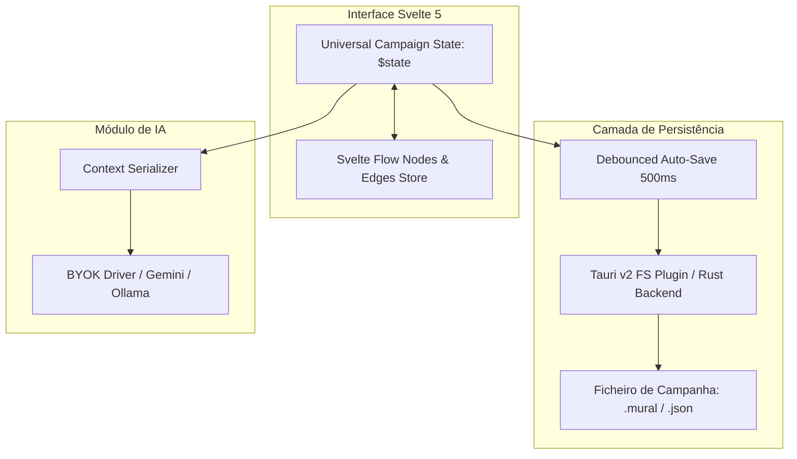

# Contexto & Arquitetura do Projeto: Mural (OrdemTools)

> **Documento de Especificação Técnica e Contexto para IA e Engenheiros de Software**  
> **Versão:** 1.0.0  
> **Propósito:** Definir de forma detalhada a arquitetura, modelos de dados, fluxo de UI/UX, integrações de IA e roadmap técnico para a aplicação *Mural (OrdemTools)*.

---

## 1. Visão Geral do Produto

**Mural (OrdemTools)** é uma ferramenta moderna de **Game Master (GM) Screen / Investigation & Conspiracy Board** projetada para Mestres e Jogadores de RPG de mesa (TTRPG) — como *Ordem Paranormal*, *D&D*, *Call of Cthulhu*, *Blades in the Dark*, *Tormenta20*, e sistemas próprios.

A aplicação combina:
1. **Quadro de Investigação / Grafo Semântico:** Criação visual de conexões entre NPCs, Locais, Facções, Pistas e Segredos.
2. **Relógios de Ameaça (Progress Clocks):** Gestão visual de contagens decrescentes e perigos crescentes na narrativa.
3. **Gestão de Segredos vs. Lore Revelado:** Marcação explícita de informação pública (*SABIDO*) vs. informação oculta (*SEGREDO*).
4. **Linha do Tempo In-Game / Registro de Sessões:** Mapeamento cronológico dos eventos e sessões da campanha.
5. **Assistente de Emergência Narrativa (IA):** Assistente contextual que ingere os nós ativos, relógios e segredos para fornecer ganchos rápidos de improviso quando a mesa foge ao planeado.

A aplicação é concebida como **Local-First**, distribuída como Web App (SPA) e Desktop Nativo ultra leve com **Tauri v2**.

---

## 2. Stack Tecnológico

| Camada | Tecnologia | Justificação / Papel |
| :--- | :--- | :--- |
| **Framework UI** | **Svelte 5** (`svelte@next` com Runes `$state`, `$derived`, `$props`) | Alta reatividade, performance nativa sem overhead de Virtual DOM, código conciso e bundle ultra leve. |
| **Build & Tooling** | **Vite + TypeScript** | Build rápido, tipagem estrita e DX otimizada. |
| **Motor de Grafo/Canvas** | **`@xyflow/svelte` (Svelte Flow)** | Biblioteca padrão da indústria para grafos interativos de nós, arestas semânticas customizadas, minimapa, pan & zoom suaves. |
| **Estilização** | **Tailwind CSS v4** | Design responsivo, tokens de cores e utilitários modernos para tema *Dark Slate / Amber Accent*. |
| **Componentes de UI** | **shadcn-svelte / Bits UI** | Componentes acessíveis e estilizáveis (Diálogos, Menus de Contexto, Tooltips, Popovers). |
| **Ícones** | **`lucide-svelte`** | Conjunto completo de ícones modernos e consistentes. |
| **Runtime Desktop** | **Tauri v2 (Rust)** | Empacotamento para desktop (Windows, macOS, Linux) com uso de RAM < 40MB, acesso seguro ao sistema de ficheiros local e persistência offline. |
| **Persistência Local** | **Local-First (JSON / SQLite via Tauri FS)** | Ficheiros de campanha locais (ex: `campanha.mural` ou `.json`), permitindo backups e portabilidade sem depender de cloud. |
| **Módulo de IA** | **SDK agnóstico (BYOK / Ollama)** | Conector configurável para Gemini, OpenAI, Claude ou Ollama (local) para assistência contextual. |

---

## 3. Arquitetura da Interface (UI / UX Blueprint)

A interface segue uma estética escura, imersiva e focada na produtividade rápida durante sessões de jogo ao vivo.

```text
+---------------------------------------------------------------------------------------------------------------+
| [Logo/Menu]  As Crónicas de Aerthys (Sessão 14)       [🔍 Procurar NPC, local, pista...]     [+ Nota rápida]  |
+----+----------------------------------------------------------------------+-----------------------------------+
| 🔲 |                                                                      | RELÓGIOS DE AMEAÇA                |
|    |      [ NPC: Serah ] -------------"é aliado de"-------------\         | ⭕ Avanço do Culto (4/6 fatias)   |
| 🗺️ |             \                                                \       | ⭕ Cerco a Vallenmoor (2/8 fatias)|
|    |      "esconde-se sob"                                 [ NPC: Orrun ] |-----------------------------------|
| 📅 |               \                                              /       | REGISTO DE LORE                   |
|    |            [ LOCAL: Vallenmoor ] --------"investiga"--------/        | [SABIDO]  Culto nas ruínas...     |
| 👤 |                   |                                                  | [SEGREDO] Serah reporta ao culto  |
|    |            [ SEGREDO: O Poço Selado ]                                | [SEGREDO] Poço sob o mercado      |
| 📖 |                                                                      | [SABIDO]  Conselho promete...     |
|    |                                                                      |-----------------------------------|
|    |                                                                      | ASSISTENTE                        |
|    |                                                                      | "A mesa descarrilou? Escreve..."  |
|    |                                                                      | [ Input / Gerar 3 Ganchos ]       |
+----+----------------------------------------------------------------------+-----------------------------------+
| ⚙️ | Bruma, Ano 998  |  Sessão 11  -------  Sessão 13  -------  [Hoje · 17]  -------  Feira · 20               |
+----+----------------------------------------------------------------------------------------------------------+
```

### Componentes de Interface Detalhados:

1. **Barra Superior (Header):**
   - Nome da Campanha & Número da Sessão ativa.
   - Caixa de Pesquisa Global com atalho (`Ctrl+K` / `Cmd+K`) para busca rápida e centralização em nós do canvas.
   - Botão de Ação Rápida `+ Nota rápida` para inserção sem fricção durante o combate/roleplay.

2. **Barra Lateral Esquerda (Navigation Rail):**
   - **Mural / Canvas** (Visualização principal do grafo de relações).
   - **Mapas / Atlas** (Upload de mapas com pins/pontos de interesse).
   - **Calendário / Linha do Tempo** (Eventos passados e futuros).
   - **Entidades / Personagens** (Lista e fichas de NPCs/PJ).
   - **Compêndio / Anotações** (Documentação escrita em Markdown).
   - **Configurações da Campanha / Tema / Chaves de API**.

3. **Área Central (Svelte Flow Canvas):**
   - Canvas infinito com grelha subtil de pontos (`dot grid`).
   - Nós customizados com cartões de cor semântica e tags:
     - **NPC:** Amarelo/Âmbar (Nome, Papel/Ocupação, Notas rápidas, Status).
     - **FAÇÃO:** Roxo/Índigo (Nome, Ideologia, Objetivo atual).
     - **LOCAL:** Azul/Ciano (Nome, Visual/Mini-mapa, Descrição, Acessos).
     - **SEGREDO / PISTA:** Vermelho/Castanho avermelhado (Descrição, Revelado: Sim/Não).
   - Arestas Semânticas com labels editáveis (*"é aliado de"*, *"esconde-se sob"*, *"investiga"*, *"deve favores a"*).

4. **Barra Lateral Direita (Painel Operacional do Mestre):**
   - **Relógios de Ameaça:** Gráfico circular SVG interativo dividido em $N$ fatias (4, 6, 8, 10, 12). Clique esquerdo preenche fatia, clique direito reduz. Ao completar, dispara alerta.
   - **Registo de Lore:** Feed de pistas com tags visuais verdes (`SABIDO`) e vermelhas (`SEGREDO`), com botão para alternar status com 1 clique quando os jogadores descobrirem a verdade.
   - **Assistente de Emergência (IA):** Prompt input rápido *"O que aconteceu?"* que injeta os nós visíveis e gera 3 ideias de contingência imediatas.

5. **Barra Inferior (Timeline de Sessões):**
   - Linha do tempo horizontal navegável com data in-game (*"Bruma, Ano 998"*) e marcadores de sessão (*"Sessão 11"*, *"Sessão 13"*, *"Hoje · 17"*).

---

## 4. Modelos de Dados (TypeScript Interfaces)

```typescript
// ==========================================
// 1. Definições da Campanha e Sessão
// ==========================================

export interface Campaign {
  id: string;
  name: string;
  system: string; // Ex: "Ordem Paranormal", "D&D 5e", "Call of Cthulhu", "Custom"
  currentSession: number;
  inGameDate: string; // Ex: "Bruma, Ano 998"
  createdAt: string;
  updatedAt: string;
  nodes: CanvasEntityNode[];
  edges: CanvasRelationEdge[];
  clocks: ThreatClock[];
  loreEntries: LoreEntry[];
  timeline: TimelineMarker[];
  settings: CampaignSettings;
}

export interface CampaignSettings {
  aiProvider: 'gemini' | 'openai' | 'anthropic' | 'ollama' | 'none';
  aiApiKey?: string;
  aiModel?: string;
  aiCustomEndpoint?: string; // Para Ollama local (ex: http://localhost:11434)
  theme: 'dark' | 'midnight' | 'paper';
}

// ==========================================
// 2. Nós do Canvas (Svelte Flow Extensions)
// ==========================================

export type EntityType = 'npc' | 'faction' | 'location' | 'secret' | 'clue' | 'quest';

export interface BaseEntityData {
  id: string;
  type: EntityType;
  title: string;
  subtitle?: string;
  description: string;
  tags: string[];
  isSecret: boolean;
  revealedToPlayers: boolean;
  avatarUrl?: string;
  color?: string;
  attributes?: Record<string, string | number>;
}

export interface NpcEntityData extends BaseEntityData {
  type: 'npc';
  role: string; // Ex: "Espia", "Bárbaro PJ nível 6"
  factionId?: string;
  status: 'alive' | 'dead' | 'missing' | 'unknown';
}

export interface FactionEntityData extends BaseEntityData {
  type: 'faction';
  leader?: string;
  motto?: string;
  goals?: string;
}

export interface LocationEntityData extends BaseEntityData {
  type: 'location';
  region?: string;
  layoutThumbnail?: string;
}

export interface SecretEntityData extends BaseEntityData {
  type: 'secret' | 'clue';
  triggerCondition?: string;
  discoveredInSession?: number;
}

export type CanvasEntityNodeData = NpcEntityData | FactionEntityData | LocationEntityData | SecretEntityData;

export interface CanvasEntityNode {
  id: string;
  type: 'customEntity';
  position: { x: number; y: number };
  data: CanvasEntityNodeData;
}

// ==========================================
// 3. Arestas e Ligações Semânticas
// ==========================================

export interface CanvasRelationEdge {
  id: string;
  source: string;
  target: string;
  label?: string; // Ex: "é aliado de", "esconde-se sob", "odeia", "sabe o segredo de"
  animated?: boolean;
  style?: Record<string, unknown>;
  relationType?: 'neutral' | 'allied' | 'hostile' | 'secret';
}

// ==========================================
// 4. Relógios de Ameaça (Progress Clocks)
// ==========================================

export interface ThreatClock {
  id: string;
  title: string;
  totalSegments: 4 | 6 | 8 | 10 | 12;
  filledSegments: number;
  category?: 'threat' | 'faction_progress' | 'countdown' | 'environmental';
  color?: string; // Hex ou classe Tailwind
  isCompleted: boolean;
  consequenceText?: string;
}

// ==========================================
// 5. Registo de Lore & Pistas
// ==========================================

export interface LoreEntry {
  id: string;
  content: string;
  status: 'SABIDO' | 'SEGREDO';
  sessionNumber: number;
  associatedNodeIds?: string[];
  createdAt: string;
}

// ==========================================
// 6. Linha do Tempo
// ==========================================

export interface TimelineMarker {
  id: string;
  sessionNumber: number;
  inGameDate: string;
  title: string;
  description?: string;
  isCurrentSession: boolean;
}
```

---

## 5. Arquitetura de Estado & Persistência Local



- **Estado Reativo (Svelte 5 Runes):**
  - O estado da campanha é gerido através de um módulo `.svelte.ts` unificado (`campaignStore.svelte.ts`) que expõe coleções reativas de nós, arestas, relógios e notas.
- **Persistência Local-First:**
  - Auto-save automático debounced (500ms) após qualquer modificação no canvas ou nos relógios.
  - No desktop (Tauri): escrita direta no disco rígido do utilizador via `@tauri-apps/plugin-fs` ou diálogo nativo de guardar/abrir ficheiro.
  - No browser (Web): fallback transparente para `IndexedDB` com opção de download/upload do ficheiro `.mural` (JSON).

---

## 6. Módulo de IA: Assistente de Emergência ("A mesa descarrilou?")

O assistente tem o objetivo estrito de apoiar o Mestre em tempo real sem alucinar nem ignorar o cenário atual:

### Estrutura do Prompt Contextual:
```text
SISTEMA:
És um co-mestre de RPG experiente, focado em improviso ágil, mantendo o suspense e a coerência narrativa.
A tua tarefa é fornecer 3 opções criativas e práticas para recolocar a história em movimento quando os jogadores tomarem uma decisão inesperada.

CONTEXTO DA CAMPANHA:
- Título: {campaign.name} (Sessão {campaign.currentSession})
- Data no Mundo: {campaign.inGameDate}
- Nós Ativos no Tabuleiro:
  {lista_formatada_de_npcs_locais_facoes_e_segredos}
- Relógios de Ameaça Atuais:
  {lista_dos_relogios_com_fatias_preenchidas}
- Segredos Não Revelados:
  {lista_de_segredos_ocultos}

SITUAÇÃO OCORRIDA NA MESA:
"{input_do_mestre}"

FORMATO DA RESPOSTA:
Apresenta exatamente 3 ganchos curtos, diretos e acionáveis:
1. [Consequência Imediata]: Uma reviravolta direta que aproveita uma fação ou NPC existente.
2. [Pista Alternativa]: Como revelar um dos segredos existentes através de um novo caminho.
3. [Avanço da Ameaça]: Como o avanço de um relógio pressiona os jogadores a agir.
```

---

## 7. Estrutura de Diretórios Recomendada

```text
Mural/
├── context_ai.md               # Este documento de referência arquitetural
├── README.md                   # Documentação do projeto para humanos e devs
├── package.json
├── svelte.config.js
├── vite.config.ts
├── tailwind.config.ts
├── tsconfig.json
├── src-tauri/                  # Backend Desktop Rust
│   ├── Cargo.toml
│   ├── tauri.conf.json
│   ├── src/
│   │   ├── main.rs
│   │   └── lib.rs
│   └── icons/
└── src/
    ├── app.css                 # Tema Dark Fantasy, cores customizadas, tipografia
    ├── app.d.ts
    ├── main.ts
    ├── App.svelte              # Layout principal da janela
    └── lib/
        ├── types/              # Tipos TypeScript (Campaign, Canvas, Clock, etc.)
        │   └── index.ts
        ├── stores/             # Estado reativo Svelte 5 (Runes)
        │   ├── campaign.svelte.ts
        │   └── canvas.svelte.ts
        ├── services/           # Persistência (FS/Tauri/IndexedDB) e IA
        │   ├── storage.ts
        │   └── aiAssistant.ts
        └── components/
            ├── layout/
            │   ├── Header.svelte
            │   ├── NavigationSidebar.svelte
            │   └── BottomTimeline.svelte
            ├── canvas/
            │   ├── CanvasView.svelte
            │   ├── nodes/
            │   │   ├── NpcNode.svelte
            │   │   ├── LocationNode.svelte
            │   │   ├── FactionNode.svelte
            │   │   └── SecretNode.svelte
            │   └── edges/
            │       └── CustomLabeledEdge.svelte
            ├── clocks/
            │   ├── ThreatClocksPanel.svelte
            │   └── CircularClock.svelte
            ├── lore/
            │   ├── LorePanel.svelte
            │   └── LoreItem.svelte
            ├── assistant/
            │   └── AiAssistantPanel.svelte
            └── ui/             # Componentes Shadcn Svelte
                ├── button/
                ├── dialog/
                ├── input/
                ├── tooltip/
                └── badge/
```

---

## 8. Roadmap de Implementação em Fases

### Fase 1: Fundação & Interface (MVP Visual)
- [ ] Criar projeto Vite + Svelte 5 + TypeScript + Tailwind CSS + Lucide Icons + shadcn-svelte.
- [ ] Desenhar o layout mestre: Header, Navigation Rail, Painel Direito, Timeline Inferior.
- [ ] Implementar o motor `@xyflow/svelte` com nós customizados (NPC, Local, Fação, Segredo) e arestas com rótulo.
- [ ] Componente SVG do Relógio de Ameaça interativo (4, 6, 8 fatias com clique).
- [ ] Painel de Registo de Lore com alternância entre `SABIDO` e `SEGREDO`.

### Fase 2: Gestão de Dados & Desktop Tauri v2
- [ ] Inicializar e configurar o core do Tauri v2 (`src-tauri`).
- [ ] Implementar o sistema de persistência de campanhas em ficheiros `.json` / `.mural`.
- [ ] Ações de Novo Projeto, Abrir Projeto, Guardar e Exportar Imagem do Grafo.
- [ ] Criação e edição dinâmica de novos nós/relações no canvas (Menu de contexto / Modals).

### Fase 3: Linha do Tempo & Assistente de IA
- [ ] Linha do tempo interativa na base com navegação entre sessões.
- [ ] Integração com APIs de IA (Gemini / OpenAI / Ollama Local) no painel do assistente de descarrilamento.
- [ ] Serialização inteligente do grafo para contexto comprimido do LLM.

### Fase 4: Polimento & Features Avançadas
- [ ] Pesquisa Global (`Ctrl+K`) com foco automático no nó pesquisado.
- [ ] Suporte a Pins em Mapas / Imagens de referência.
- [ ] Modo de Apresentação para Jogadores (Fog of War que esconde segredos).
- [ ] Build e empacotamento de instaladores nativos (.msi / .exe / .dmg / .deb).
